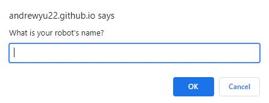
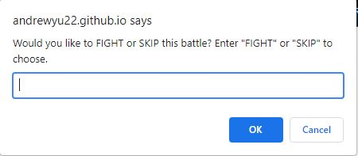
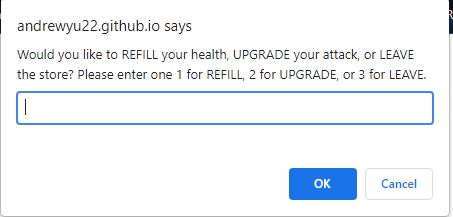

# Robot Gladiators

## Description 

A fun JavaScript game that prompt users to battle against 3 round of enemy.

Repo: https://github.com/andrewyu22/robot-gladiators

Link: https://andrewyu22.github.io/robot-gladiators/

---
## Table of Contents 

* [Installation](#installation)
* [Usage](#usage)
* [License](#license)
* [Contributing](#contributing)
* [Tests](#tests)
* [Questions](#questions)

---
## Installation

No Installation required for this project!

---
## Usage 

1) Prompt users for robot name.

2) Prompt users for an action.

3) After each battle (3 Rounds of battle), users can enter the shop to Refill health or increase damage. Winning Each Battle increases the money for the shop.

---
## License

No Licenses for this project!

---
## Contributing

No contribution information for this project!

---
## Tests

No test for this project!

---
## Questions

Link to Github: https://github.com/andrewyu22

If you have any further questions, please contact me at andrewyu2654@gmail.com